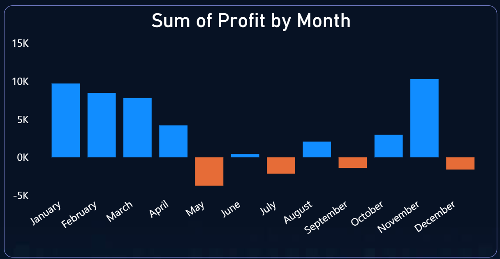
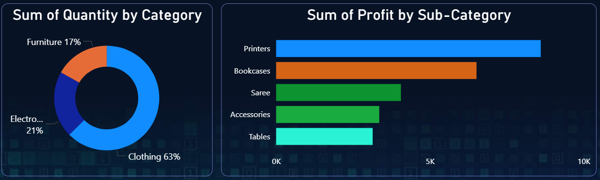

# 📊 E-Commerce Sales Dashboard (Power BI)

An interactive **Power BI dashboard** designed to analyze e-commerce sales performance, identify profit trends, understand customer behavior, and uncover actionable business insights for decision-making.

This project focuses on **what decisions can be made from the data**, not just visualizations.

---

## 🔍 Problem Statement

Businesses often struggle to understand:
- Why profits fluctuate across months
- Which categories and sub-categories drive profitability
- How customer behavior and payment modes impact revenue
- Which regions contribute most to sales and growth

This dashboard addresses these challenges by providing a **single, interactive view of key sales and profit metrics**.

---

## 📁 Dataset

The analysis is based on two datasets:

- `Orders.csv` – Order-level transactional data  
- `Details.csv` – Product, category, and customer details  

The datasets were cleaned, transformed, and modeled using **Power Query** in Power BI.

---

## 📌 KPIs Tracked

- **Total Revenue**
- **Total Profit**
- **Total Quantity Sold**
- **Average Order Value (AOV)**
- **Monthly Profit Trends**

These KPIs help evaluate both **top-line performance** and **operational efficiency**.

---

## 📸 Dashboard Snapshots

### 🔹 Overview

Shows high-level KPIs such as revenue, profit, quantity sold, and AOV to quickly assess overall business performance.

---

### 🔹 Monthly Profit Trend

Highlights seasonal patterns, identifying months with strong profitability and periods of loss or low margins.

---

### 🔹 Category & Sub-Category Analysis

Analyzes which product categories and sub-categories contribute most to profit and volume, helping identify high- and low-performing segments.

---

## 📈 Key Insights & Conclusions

- The business generated **₹438K in revenue** with a total profit of **₹37K**, indicating moderate margins.
- Profitability is **seasonal**, with strong performance in **Q1 and Q4**, while certain mid-year months show losses.
- **Clothing** dominates sales volume, while specific sub-categories such as **Printers and Bookcases** generate higher profits.
- A small group of customers contributes a significant portion of revenue, indicating opportunities for **targeted retention strategies**.
- **Cash on Delivery (COD)** is the most used payment mode, increasing operational risk and cost.

---

## 🎯 Business Recommendations

Based on the insights:
- Focus marketing and inventory planning around **high-profit months**.
- Encourage **digital payments** to reduce COD-related costs.
- Re-evaluate pricing and sourcing for **low-margin sub-categories**.
- Invest in retention strategies for **high-value customers**.
- Expand operations and promotions in **top-performing states**.

---

## 🛠 Tools & Technologies Used

- **Power BI**
  - Power Query (data cleaning & transformation)
  - DAX (calculated measures & KPIs)
  - Interactive visuals and slicers
- **Data Analysis Concepts**
  - KPI design
  - Trend & profitability analysis
  - Business storytelling through dashboards

---

## 🚀 How to Use This Project

1. Download the `.pbix` file from the `dashboard/` folder.
2. Open it in **Power BI Desktop**.
3. Interact with slicers to explore trends by time, category, and region.

---

## 🔗 Live Dashboard

A live, publicly accessible version of this dashboard is available via Power BI Service:

👉 Live Dashboard: https://app.powerbi.com/groups/me/reports/255ac0cf-080e-4926-8be4-9447cad2d844/dc3e8428e1b4d100867d?experience=power-bi

---

## 🧠 Why This Project Matters

This dashboard demonstrates the ability to:
- Translate raw data into **business insights**
- Design **stakeholder-friendly KPIs**
- Support **data-driven decision-making**
- Communicate findings clearly through visuals

---

## 📄 License

This project is licensed under the **MIT License**.  
Feel free to use, modify, and learn from it.

---

## 👤 Author

**Hemang Krish**  
📧 hemangkrish7@gmail.com  
🔗 LinkedIn: https://linkedin.com/in/hemang-krish-a739a1229  
💻 GitHub: https://github.com/hemangkrish7  
🌐 Portfolio: https://portfolio-github-io-ten.vercel.app/
